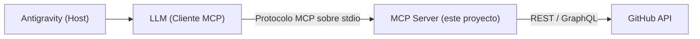

# GitHub MCP Agent

**Tipo de documento:** `Guía de Implementación`
**Versión:** `1.0.0`
**Estado:** `Implementado`

Servidor **MCP (Model Context Protocol)** que expone operaciones de GitHub (repositorios, issues, commits y ramas) como *tools* invocables por un agente de IA. Permite que un asistente conversacional — por ejemplo, **Antigravity** — gestione repositorios reales de GitHub a través de lenguaje natural, sin que el desarrollador tenga que escribir llamadas a la API manualmente.

---

## Contexto y objetivo

Un LLM por sí solo no puede ejecutar acciones sobre sistemas externos. Este proyecto resuelve ese problema implementando un servidor MCP que:

- Traduce *tool calls* del LLM en llamadas reales a la API REST/GraphQL de GitHub (vía [Octokit](https://github.com/octokit/rest.js)).
- Valida cada entrada con [Zod](https://zod.dev/) antes de tocar la API (nombres de repos, ramas, SHAs, etc.).
- Exige confirmación explícita antes de ejecutar acciones irreversibles (borrar un repo, borrar un issue, reescribir el historial de una rama).

---

## Arquitectura



| Componente | Responsabilidad |
|------------|------------------|
| **Antigravity (Host)** | Aplicación donde el usuario escribe el prompt; lanza y administra el proceso del servidor MCP. |
| **LLM (Cliente MCP)** | Decide qué tool invocar según el prompt del usuario y con qué parámetros. |
| **MCP Server** | Este proyecto: registra las tools, valida sus parámetros y traduce cada llamada en una petición a GitHub. |
| **GitHub API** | Fuente de verdad: repositorios, issues, ramas y commits reales. |

---

## Requisitos previos

- [Node.js](https://nodejs.org/) 18 o superior.
- Una cuenta de GitHub.
- Un **Personal Access Token (PAT)** de GitHub (ver sección [Configuración](#configuración)).
- Antigravity (u otro host/cliente MCP) configurado para lanzar servidores MCP locales por `stdio`.

---

## Instalación paso a paso

1. **Clonar el repositorio**

   ```bash
   git clone <url-del-repositorio>
   cd ProyectoM5_MartinVelez
   ```

2. **Instalar dependencias**

   ```bash
   npm install
   ```

3. **Crear el archivo de variables de entorno**

   ```bash
   cp .env.example .env
   ```

4. **Obtener un GitHub Personal Access Token** y pegarlo en `.env` (ver sección siguiente).

5. **Verificar que compila y tipa correctamente**

   ```bash
   npm run typecheck
   ```

6. **Ejecutar el servidor**

   - Modo desarrollo (recarga automática con `tsx`):

     ```bash
     npm run dev
     ```

   - Modo producción:

     ```bash
     npm run build
     npm run start
     ```

   Si todo está bien configurado, verás en consola: `Server is running...`

---

## Configuración

### Cómo obtener un GitHub Personal Access Token

1. Inicia sesión en [github.com](https://github.com).
2. Ve a **Settings** (clic en tu avatar, arriba a la derecha) → **Developer settings** (al final del menú lateral).
3. Entra a **Personal access tokens** → **Tokens (classic)** → **Generate new token** → **Generate new token (classic)**.
4. Ponle un nombre descriptivo (ej. `mcp-github-agent`) y define una expiración.
5. Selecciona los **scopes** según las tools que vayas a usar:
   - `repo` — necesario para crear/leer repos, issues, commits y ramas (incluye repos privados).
   - `delete_repo` — necesario únicamente si vas a usar la tool `delete_repository`.
6. Haz clic en **Generate token** y **copia el token inmediatamente** (GitHub no lo muestra de nuevo).

### Configurar la variable de entorno

Edita el archivo `.env` en la raíz del proyecto:

```env
GITHUB_TOKEN=ghp_tuTokenReal
```

> ⚠️ El archivo `.env` ya está en `.gitignore`. Nunca subas tu token a un repositorio.

### Conectar el servidor a Antigravity

Registra el servidor como MCP server en la configuración de Antigravity (host), indicando cómo lanzar el proceso y la variable de entorno con el token:

```json
{
  "mcpServers": {
    "github-agent": {
      "command": "node",
      "args": ["dist/server/index.js"],
      "env": {
        "GITHUB_TOKEN": "ghp_tuTokenReal"
      }
    }
  }
}
```

(En desarrollo puedes usar `"command": "npx", "args": ["tsx", "src/server/index.ts"]` para no tener que compilar cada vez.)

---

## Tools disponibles

Todas las tools devuelven texto plano (éxito o error) y validan sus parámetros con Zod antes de llamar a GitHub.

### Repositorios

#### `get_repository`
Trae la información principal de un repositorio.
- **Parámetros:** `owner`, `repo`
- **Prompt de ejemplo:** *"Tráeme la información del repositorio mstivenvelezc-ctrl/ProyectoM5"*

#### `list_repositories`
Lista los repositorios del usuario autenticado, ordenados por última actualización.
- **Parámetros:** `perPage` (1–100, por defecto 30)
- **Prompt de ejemplo:** *"Lista mis 10 repositorios más recientes"*

#### `create_repository`
Crea un repositorio nuevo en la cuenta autenticada.
- **Parámetros:** `name`, `description` (opcional), `isPrivate` (por defecto `false`)
- **Prompt de ejemplo:** *"Crea un repositorio privado llamado 'api-clientes' con la descripción 'Backend de gestión de clientes'"*

#### `delete_repository` ⚠️ destructiva
Elimina un repositorio permanentemente. Requiere doble confirmación.
- **Parámetros:** `owner`, `repo`, `confirm`, `confirmName` (debe ser exactamente `"owner/repo"`)
- **Flujo:** primera llamada sin `confirm: true` → el servidor responde con una alerta y no ejecuta nada. Segunda llamada con `confirm: true` y `confirmName` igual al nombre completo del repo → ejecuta el borrado.
- **Prompt de ejemplo:** *"Elimina el repositorio mstivenvelezc-ctrl/api-clientes-pruebas"*

### Issues

#### `create_issue`
Abre un issue en un repositorio.
- **Parámetros:** `owner`, `repo`, `title`, `body` (opcional)
- **Prompt de ejemplo:** *"Crea un issue en mstivenvelezc-ctrl/api-clientes titulado 'Bug: login falla con email en mayúsculas'"*

#### `list_issues`
Lista los issues de un repositorio (por defecto solo los abiertos).
- **Parámetros:** `owner`, `repo`, `state` (`open` | `closed` | `all`), `perPage`
- **Prompt de ejemplo:** *"Muéstrame todos los issues cerrados de mstivenvelezc-ctrl/api-clientes"*

#### `delete_issue` ⚠️ destructiva
Elimina permanentemente un issue (requiere permisos de admin/owner en el repo).
- **Parámetros:** `owner`, `repo`, `issueNumber`, `confirm`
- **Prompt de ejemplo:** *"Borra el issue #12 de mstivenvelezc-ctrl/api-clientes"*

### Commits y ramas

#### `create_commit`
Crea o actualiza un archivo (commit) en una rama de un repositorio.
- **Parámetros:** `owner`, `repo`, `path`, `content`, `message`, `branch` (opcional, usa la rama por defecto si se omite)
- **Prompt de ejemplo:** *"Crea un commit en mstivenvelezc-ctrl/api-clientes que agregue un archivo README.md con el texto 'Hola mundo' y el mensaje 'docs: agrega README'"*

#### `revert_to_commit` ⚠️ destructiva
Mueve una rama a un commit anterior (hard reset), descartando los commits posteriores.
- **Parámetros:** `owner`, `repo`, `sha`, `branch` (opcional), `confirm`
- **Prompt de ejemplo:** *"Regresa la rama main de mstivenvelezc-ctrl/api-clientes al commit a1b2c3d"*

#### `create_branch`
Crea una rama nueva a partir de una rama base (por defecto `main`).
- **Parámetros:** `owner`, `repo`, `branch`, `base` (por defecto `main`)
- **Prompt de ejemplo:** *"Crea la rama feature/login-google en mstivenvelezc-ctrl/api-clientes a partir de main"*

#### `merge_branch`
Fusiona una rama (`head`) dentro de otra rama base (por defecto `main`).
- **Parámetros:** `owner`, `repo`, `head`, `base` (por defecto `main`), `commit_message` (opcional)
- **Prompt de ejemplo:** *"Fusiona la rama feature/login-google dentro de main en mstivenvelezc-ctrl/api-clientes"*

#### `sync_branch`
Trae los cambios de la rama principal y los fusiona dentro de otra rama, para mantenerla actualizada.
- **Parámetros:** `owner`, `repo`, `branch`, `base` (por defecto `main`), `commit_message` (opcional)
- **Prompt de ejemplo:** *"Actualiza la rama feature/login-google con los últimos cambios de main en mstivenvelezc-ctrl/api-clientes"*

### Acciones destructivas: cómo funcionan las confirmaciones

Las tools marcadas con ⚠️ (`delete_repository`, `delete_issue`, `revert_to_commit`) nunca ejecutan la acción en la primera llamada si no se envía `confirm: true`: en su lugar devuelven una alerta describiendo exactamente qué se va a perder. El LLM debe volver a llamar la misma tool con `confirm: true` (y, en el caso de `delete_repository`, repitiendo el nombre completo `owner/repo` en `confirmName`) para que la acción se ejecute de verdad.

---

## Decisiones Técnicas

Estas son las decisiones tecnicas mas importantes del proyecto, explicadas con mis propias palabras despues de revisar el codigo a fondo.

### 1. Confirmacion en dos pasos para acciones destructivas

Las tools `delete_repository`, `delete_issue` y `revert_to_commit` no ejecutan la accion en la primera llamada si no se manda `confirm: true`, en cambio devuelven una alerta explicando que se va a perder. Se decidio de esta manera porque son acciones muy riesgozas que ponen en riesgo todo un proyecto y pueden perjudicar la operacion de manera permanente. En GitHub estas acciones no se pueden deshacer despues, asi que no sirve ejecutar primero y arreglar el error mas tarde, hay que evitar el accidente antes de que pase, no despues. La alerta tambien le muestra al agente exactamente que se va a borrar (titulo, nombre, url) para que pueda decidir si de verdad quiere insistir o no.

### 2. Confirmacion extra con `confirmName` solo en `delete_repository`

Ademas del `confirm: true`, esta tool pide reescribir el `owner/repo` exacto en `confirmName`, para estar seguros que lo que queremos eliminar coinside con la accion que estamos tomando. Esto solo se hizo para borrar repositorios y no para issues o el revert, porque borrar un repo tiene un radio de impacto mucho mas grande: se pierden todos los issues, pull requests, wiki, releases y forks de una sola vez, mientras que borrar un issue o revertir una rama solo afecta una parte chiquita del proyecto. A mayor riesgo, mayor friccion para confirmar, esa es la idea.

### 3. Octokit como singleton

El cliente de Octokit se crea una sola vez en `getOctokit()` y se reutiliza, en lugar de crear una instancia nueva en cada tool, para no tener que agregar instancias repetidas en cada una y para mantener todo mas centralizado. Tambien evita repetir la validacion del `GITHUB_TOKEN` en doce lugares distintos en vez de uno solo, y si algun dia se quiere agregar cache o control de rate-limit, hay un unico punto donde hacerlo.

### 4. GraphQL solo para `delete_issue`

Casi todas las tools usan los metodos REST normales de Octokit, pero `delete_issue` usa `octokit.graphql()` con la mutacion `deleteIssue`. Esto es porque GitHub no tiene un endpoint REST para borrar issues de verdad, por REST solo se pueden cerrar, el unico lugar donde existe el borrado permanente es la API de GraphQL. Por eso la tool primero usa REST (`issues.get`) para traer el issue y obtener su `node_id`, y despues usa GraphQL nada mas para la mutacion del borrado.

### 5. Transporte stdio en vez de HTTP

El servidor usa `StdioServerTransport` porque se usa de manera local, lo que facilita la comunicacion al estar dentro del mismo equipo, sin tener que manejar puertos ni autenticacion de red. El host (Antigravity) simplemente lanza el servidor como proceso hijo y habla por stdin/stdout. HTTP se usaria en el caso de hacer deploy del servidor en la nube, para que varias personas o maquinas distintas puedan compartir una sola instancia corriendo de forma remota.

### 6. Esquemas de Zod centralizados

Todas las reglas de validacion (nombre de repo, owner, rama, sha, etc.) viven en `src/schemas/github.ts` y cada tool las importa, en vez de que cada una defina sus propias reglas por separado. Esto se hizo para mantener el proyecto mas ordenado y mas facil de escalar con nuevas tools a futuro, y tambien evita que dos tools terminen validando lo mismo con reglas un poco distintas sin que nadie se de cuenta. Si GitHub cambia una regla se actualiza en un solo lugar y todas las tools quedan iguales otra vez.

### 7. `filePathSchema` rechaza rutas absolutas y con `..`

El parametro `path` de `create_commit` se inserta directo en la url del endpoint de Contents API, y como ese valor lo decide un LLM interpretando un prompt, se trata como un input no confiable. Una ruta que empiece con `/` puede generar una ruta mal formada en la API, y una ruta con `..` es el patron clasico de path traversal. Aunque aqui no hay un filesystem real detras (es el arbol de git, no carpetas reales), se sigue la misma buena practica de sanitizar cualquier input que venga de afuera.

### 8. Rama base `"main"` hardcodeada vs `default_branch` real (limitacion conocida)

En `create_branch`, `merge_branch` y `sync_branch` el parametro `base` por defecto es el literal `"main"`, mientras que en `revert_to_commit`, cuando no se manda `branch`, el codigo si consulta a la API (`octokit.repos.get`) y usa el `default_branch` real del repositorio. Esto es una inconsistencia entre las tools del mismo proyecto: si un repositorio tiene su rama principal con otro nombre (`master`, `trunk`, etc.) las primeras tres tools van a fallar buscando `heads/main`, aunque el repo si tenga una rama por defecto valida, solo que con otro nombre. Queda documentado aqui como limitacion conocida, pendiente de corregir para que las tres consulten el `default_branch` real igual que ya hace `revert_to_commit`.

### 9. Anotaciones `destructiveHint`, `idempotentHint` y `openWorldHint`

Las tools `delete_repository`, `delete_issue` y `revert_to_commit` tienen estas anotaciones del protocolo MCP, que ninguna otra tool del proyecto tiene. Le sirven al host (Antigravity) para decidir como tratar la tool sin tener que leer su codigo por dentro: `destructiveHint: true` avisa que la accion puede causar perdida de datos irreversible, `idempotentHint` indica si llamarla varias veces con los mismos parametros es seguro, y `openWorldHint: true` indica que la tool interactua con un sistema externo impredecible (GitHub) y no con datos cerrados. Esto explica en parte por que Antigravity pide varias confirmaciones para una sola accion: el host agrega su propia capa de confirmacion por culpa del `destructiveHint`, ademas de la confirmacion que la tool ya implementa por dentro, son dos capas de seguridad independientes que se suman una arriba de la otra.

### 10. `merge_branch` y `sync_branch` como tools separadas

Las dos tools llaman a `octokit.repos.merge` casi igual, la unica diferencia real es la direccion: una trae los cambios de la rama principal hacia mi rama, y la otra envia mis cambios hacia la rama principal. Se decidio tener dos tools separadas en vez de una sola con un parametro de direccion porque asi el LLM elige la tool correcta solo por su nombre y descripcion, sin tener que adivinar bien un parametro ambiguo a partir del prompt del usuario. Lo que se pierde con esto es que el codigo de las dos tools queda casi duplicado, asi que si la logica de merge cambia hay que tocarla en dos archivos en vez de uno.

---

## Pruebas

El proyecto usa [Vitest](https://vitest.dev/) con un servidor MCP simulado (`src/test/mockServer.ts`) para probar cada tool sin llamar a la API real de GitHub.

```bash
npm run test        # ejecuta toda la suite una vez
npm run test:watch  # modo watch
```

---

## Estructura del proyecto

```
src/
├── server/index.ts       # punto de entrada: registra todas las tools y conecta el transporte stdio
├── github/client.ts      # instancia de Octokit autenticada con GITHUB_TOKEN
├── schemas/github.ts      # esquemas Zod compartidos (validación de inputs)
├── lib/result.ts          # helpers de respuesta (ok, fail, needsConfirmation)
├── tools/                 # una tool por archivo (create_repository, delete_issue, etc.)
└── test/                  # mock del servidor MCP + tests por tool
```
