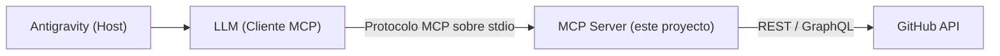

# GitHub MCP Agent

**Tipo de documento:** `Guía de Implementación`
**Versión:** `1.0.0`
**Estado:** `Implementado`

Servidor **MCP (Model Context Protocol)** que expone operaciones de GitHub (repositorios, issues, commits y ramas) como *tools* invocables por un agente de IA. Permite que un asistente conversacional — por ejemplo, **Antigravity** — gestione repositorios reales de GitHub a través de lenguaje natural, sin que el desarrollador tenga que escribir llamadas a la API manualmente.

---

## Contexto y objetivo

Un LLM por sí solo no puede ejecutar acciones sobre sistemas externos. Este proyecto resuelve ese problema implementando un servidor MCP que:

- Traduce *tool calls* del LLM en llamadas reales a la API REST/GraphQL de GitHub (vía [Octokit](https://github.com/octokit/rest.js)).
- Valida cada entrada con [Zod](https://zod.dev/) antes de tocar la API (nombres de repos, ramas, SHAs, etc.).
- Exige confirmación explícita antes de ejecutar acciones irreversibles (borrar un repo, borrar un issue, reescribir el historial de una rama).

---

## Arquitectura



| Componente | Responsabilidad |
|------------|------------------|
| **Antigravity (Host)** | Aplicación donde el usuario escribe el prompt; lanza y administra el proceso del servidor MCP. |
| **LLM (Cliente MCP)** | Decide qué tool invocar según el prompt del usuario y con qué parámetros. |
| **MCP Server** | Este proyecto: registra las tools, valida sus parámetros y traduce cada llamada en una petición a GitHub. |
| **GitHub API** | Fuente de verdad: repositorios, issues, ramas y commits reales. |

---

## Requisitos previos

- [Node.js](https://nodejs.org/) 18 o superior.
- Una cuenta de GitHub.
- Un **Personal Access Token (PAT)** de GitHub (ver sección [Configuración](#configuración)).
- Antigravity (u otro host/cliente MCP) configurado para lanzar servidores MCP locales por `stdio`.

---

## Instalación paso a paso

1. **Clonar el repositorio**

   ```bash
   git clone <url-del-repositorio>
   cd ProyectoM5_MartinVelez
   ```

2. **Instalar dependencias**

   ```bash
   npm install
   ```

3. **Crear el archivo de variables de entorno**

   ```bash
   cp .env.example .env
   ```

4. **Obtener un GitHub Personal Access Token** y pegarlo en `.env` (ver sección siguiente).

5. **Verificar que compila y tipa correctamente**

   ```bash
   npm run typecheck
   ```

6. **Ejecutar el servidor**

   - Modo desarrollo (recarga automática con `tsx`):

     ```bash
     npm run dev
     ```

   - Modo producción:

     ```bash
     npm run build
     npm run start
     ```

   Si todo está bien configurado, verás en consola: `Server is running...`

---

## Configuración

### Cómo obtener un GitHub Personal Access Token

1. Inicia sesión en [github.com](https://github.com).
2. Ve a **Settings** (clic en tu avatar, arriba a la derecha) → **Developer settings** (al final del menú lateral).
3. Entra a **Personal access tokens** → **Tokens (classic)** → **Generate new token** → **Generate new token (classic)**.
4. Ponle un nombre descriptivo (ej. `mcp-github-agent`) y define una expiración.
5. Selecciona los **scopes** según las tools que vayas a usar:
   - `repo` — necesario para crear/leer repos, issues, commits y ramas (incluye repos privados).
   - `delete_repo` — necesario únicamente si vas a usar la tool `delete_repository`.
6. Haz clic en **Generate token** y **copia el token inmediatamente** (GitHub no lo muestra de nuevo).

### Configurar la variable de entorno

Edita el archivo `.env` en la raíz del proyecto:

```env
GITHUB_TOKEN=ghp_tuTokenReal
```

> ⚠️ El archivo `.env` ya está en `.gitignore`. Nunca subas tu token a un repositorio.

### Conectar el servidor a Antigravity

Registra el servidor como MCP server en la configuración de Antigravity (host), indicando cómo lanzar el proceso y la variable de entorno con el token:

```json
{
  "mcpServers": {
    "github-agent": {
      "command": "node",
      "args": ["dist/server/index.js"],
      "env": {
        "GITHUB_TOKEN": "ghp_tuTokenReal"
      }
    }
  }
}
```

(En desarrollo puedes usar `"command": "npx", "args": ["tsx", "src/server/index.ts"]` para no tener que compilar cada vez.)

---

## Tools disponibles

Todas las tools devuelven texto plano (éxito o error) y validan sus parámetros con Zod antes de llamar a GitHub.

### Repositorios

#### `get_repository`
Trae la información principal de un repositorio.
- **Parámetros:** `owner`, `repo`
- **Prompt de ejemplo:** *"Tráeme la información del repositorio mstivenvelezc-ctrl/ProyectoM5"*

#### `list_repositories`
Lista los repositorios del usuario autenticado, ordenados por última actualización.
- **Parámetros:** `perPage` (1–100, por defecto 30)
- **Prompt de ejemplo:** *"Lista mis 10 repositorios más recientes"*

#### `create_repository`
Crea un repositorio nuevo en la cuenta autenticada.
- **Parámetros:** `name`, `description` (opcional), `isPrivate` (por defecto `false`)
- **Prompt de ejemplo:** *"Crea un repositorio privado llamado 'api-clientes' con la descripción 'Backend de gestión de clientes'"*

#### `delete_repository` ⚠️ destructiva
Elimina un repositorio permanentemente. Requiere doble confirmación.
- **Parámetros:** `owner`, `repo`, `confirm`, `confirmName` (debe ser exactamente `"owner/repo"`)
- **Flujo:** primera llamada sin `confirm: true` → el servidor responde con una alerta y no ejecuta nada. Segunda llamada con `confirm: true` y `confirmName` igual al nombre completo del repo → ejecuta el borrado.
- **Prompt de ejemplo:** *"Elimina el repositorio mstivenvelezc-ctrl/api-clientes-pruebas"*

### Issues

#### `create_issue`
Abre un issue en un repositorio.
- **Parámetros:** `owner`, `repo`, `title`, `body` (opcional)
- **Prompt de ejemplo:** *"Crea un issue en mstivenvelezc-ctrl/api-clientes titulado 'Bug: login falla con email en mayúsculas'"*

#### `list_issues`
Lista los issues de un repositorio (por defecto solo los abiertos).
- **Parámetros:** `owner`, `repo`, `state` (`open` | `closed` | `all`), `perPage`
- **Prompt de ejemplo:** *"Muéstrame todos los issues cerrados de mstivenvelezc-ctrl/api-clientes"*

#### `delete_issue` ⚠️ destructiva
Elimina permanentemente un issue (requiere permisos de admin/owner en el repo).
- **Parámetros:** `owner`, `repo`, `issueNumber`, `confirm`
- **Prompt de ejemplo:** *"Borra el issue #12 de mstivenvelezc-ctrl/api-clientes"*

### Commits y ramas

#### `create_commit`
Crea o actualiza un archivo (commit) en una rama de un repositorio.
- **Parámetros:** `owner`, `repo`, `path`, `content`, `message`, `branch` (opcional, usa la rama por defecto si se omite)
- **Prompt de ejemplo:** *"Crea un commit en mstivenvelezc-ctrl/api-clientes que agregue un archivo README.md con el texto 'Hola mundo' y el mensaje 'docs: agrega README'"*

#### `revert_to_commit` ⚠️ destructiva
Mueve una rama a un commit anterior (hard reset), descartando los commits posteriores.
- **Parámetros:** `owner`, `repo`, `sha`, `branch` (opcional), `confirm`
- **Prompt de ejemplo:** *"Regresa la rama main de mstivenvelezc-ctrl/api-clientes al commit a1b2c3d"*

#### `create_branch`
Crea una rama nueva a partir de una rama base (por defecto `main`).
- **Parámetros:** `owner`, `repo`, `branch`, `base` (por defecto `main`)
- **Prompt de ejemplo:** *"Crea la rama feature/login-google en mstivenvelezc-ctrl/api-clientes a partir de main"*

#### `merge_branch`
Fusiona una rama (`head`) dentro de otra rama base (por defecto `main`).
- **Parámetros:** `owner`, `repo`, `head`, `base` (por defecto `main`), `commit_message` (opcional)
- **Prompt de ejemplo:** *"Fusiona la rama feature/login-google dentro de main en mstivenvelezc-ctrl/api-clientes"*

#### `sync_branch`
Trae los cambios de la rama principal y los fusiona dentro de otra rama, para mantenerla actualizada.
- **Parámetros:** `owner`, `repo`, `branch`, `base` (por defecto `main`), `commit_message` (opcional)
- **Prompt de ejemplo:** *"Actualiza la rama feature/login-google con los últimos cambios de main en mstivenvelezc-ctrl/api-clientes"*

### Acciones destructivas: cómo funcionan las confirmaciones

Las tools marcadas con ⚠️ (`delete_repository`, `delete_issue`, `revert_to_commit`) nunca ejecutan la acción en la primera llamada si no se envía `confirm: true`: en su lugar devuelven una alerta describiendo exactamente qué se va a perder. El LLM debe volver a llamar la misma tool con `confirm: true` (y, en el caso de `delete_repository`, repitiendo el nombre completo `owner/repo` en `confirmName`) para que la acción se ejecute de verdad.

---

## Pruebas

El proyecto usa [Vitest](https://vitest.dev/) con un servidor MCP simulado (`src/test/mockServer.ts`) para probar cada tool sin llamar a la API real de GitHub.

```bash
npm run test        # ejecuta toda la suite una vez
npm run test:watch  # modo watch
```

---

## Estructura del proyecto

```
src/
├── server/index.ts       # punto de entrada: registra todas las tools y conecta el transporte stdio
├── github/client.ts      # instancia de Octokit autenticada con GITHUB_TOKEN
├── schemas/github.ts      # esquemas Zod compartidos (validación de inputs)
├── lib/result.ts          # helpers de respuesta (ok, fail, needsConfirmation)
├── tools/                 # una tool por archivo (create_repository, delete_issue, etc.)
└── test/                  # mock del servidor MCP + tests por tool
```
